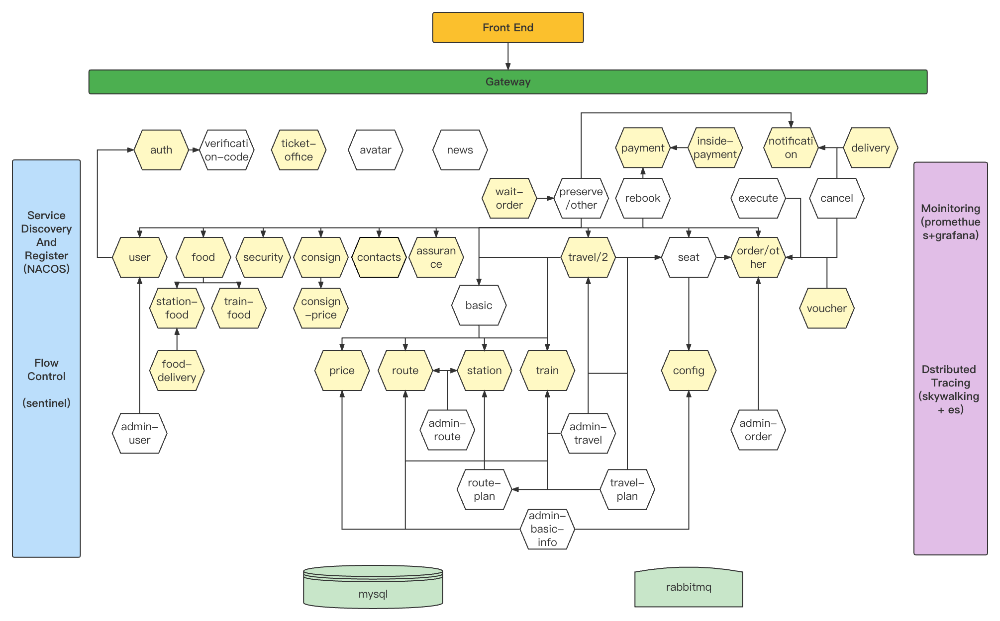

# Augmented-TrainTicket：A Benchmark Microservice System

The project is a train ticket booking system based on microservice architecture which contains 41 microservices. The programming languages and frameworks it used are as below.
- Java - Spring Boot, Spring Cloud
- Node.js - Express
- Python - Django
- Go - Webgo
- DB - Mongo、MySQL

This Augmented-Train Ticket is open-sourced by submited FSE 2023 paper Nezha

## Service Architecture Graph


## Quick Start
We provide k8s deployment to quickly deploy our application:  [Using Kubernetes](#Using-Kubernetes).

### Using Kubernetes
Here is the steps to deploy the Train Ticket onto any existing Kubernetes cluster.

#### Presequisite
* An existing Kubernetes cluster
* Helm supported, you can see https://helm.sh/docs/helm/helm_install/ for helm install
* PVC supported, you can see https://openebs.io/docs/2.12.x/user-guides/installation for localPV support.

#### 1. Clone the Repository
```bash
git clone --depth=1 https://github.com/FudanSELab/train-ticket.git 
cd train-ticket/
```

#### 2. Deploy the application
### For Quick Start
```bash
make deploy

```

Note: if you want specify namespace, set Namespace paramter:

```bash
make deploy Namespace=yournamespace
```

### Deploy Mysql Clusters For Each Services

```bash
make deploy DeployArgs="--independent-db"
```

### With Moinitorig
```bash
make deploy DeployArgs="--with-monitoring"
```

### With Distributed Tracing
```bash
make deploy DeployArgs="--with-tracing"
```

### Deploy All 
```bash
make deploy DeployArgs="--all"
```

### Customise Deployment
You can freely combine parameters for custom deployment， for example, deploy with monitoring and tracing:

```bash
make deploy DeployArgs="--with-tracing --with-monitoring"
```

### Reset Deployment

```
make reset-deploy
# if you specify namespace when deploy, set namespace as well when reset
# make reset-deploy Namespace=yournamespace
```

#### 3. Run `kubectl get pods` to see pods are in a ready state

#### 4. Visit the Train Ticket web page at [http://[Node-IP]:32677](http://[Node-IP]:32677).


## Build From Source
In the above, We use pre-built images to quickly deploy the application.

If you want to build the application from source, you can refer to [the Installation Guide](https://github.com/FudanSELab/train-ticket/wiki/Installation-Guide).

## Test scripts
Use scripts to test train-ticket: [https://github.com/FudanSELab/train-ticket-auto-query](https://github.com/FudanSELab/train-ticket-auto-query)

## Screenshot

In order to know how to use the application, you can refer to [the User Guide](https://github.com/FudanSELab/train-ticket/wiki/User-Guide).

## Communication

* [FAQ](https://github.com/FudanSELab/train-ticket/wiki/FAQ)
* [Submit an issue](https://github.com/FudanSELab/train-ticket/issues)
* [Open a pull request](https://github.com/FudanSELab/train-ticket/pulls)

## Information

* [Release Note](https://github.com/FudanSELab/train-ticket/wiki/Release-Note)

## Serverless Train Ticket

We have released a serverless version of Train Ticket.

* [serverless-trainticket](https://github.com/FudanSELab/serverless-trainticket)

## Paper Reference
Bowen Li, Xin Peng, Qilin Xiang, Hanzhang Wang, Tao Xie, Jun Sun, Xuanzhe Liu. <br/>
**Enjoy your observability: an industrial survey of microservice tracing and analysis**<br/>
[Empirical Software Engineering](https://www.springer.com/journal/10664/), Volume 27, 25, 2022.<br/>
Download:[[PDF](https://link.springer.com/content/pdf/10.1007/s10664-021-10063-9.pdf)]

<br/>

Chenxi Zhang, Xin Peng, Chaofeng Sha, Ke Zhang, Zhenqing Fu, Xiya Wu, Qingwei Lin, Dongmei Zhang<br/>
**DeepTraLog: Trace-Log Combined Microservice Anomaly Detection through Graph-based Deep Learning**<br/>
In Proceedings of the 44th International Conference on Software Engineering ([ICSE 2022](https://dblp.uni-trier.de/db/conf/icse/icse2022.html)) , Pittsburgh, USA, May, 2022.<br/>
Download:[[PDF](https://dl.acm.org/doi/pdf/10.1145/3510003.3510180)]

<br/>
	
Dewei Liu, Chuan He, Xin Peng, Fan Lin, Chenxi Zhang, Shengfang Gong, Ziang Li, Jiayu Ou, Zheshun Wu<br/>
**MicroHECL: High-Efficient Root Cause Localization in Large-Scale Microservice Systems**<br/>
In Proceedings of the 43rd IEEE/ACM International Conference on Software Engineering: Software Engineering in Practice ([ICSE-SEIP 2021](https://dblp.uni-trier.de/db/conf/icse/seip2021.html#LiuH0LZGLOW21)) , Madrid, Spain, May, 2021.<br/>
Download:[[PDF](https://ieeexplore.ieee.org/stamp/stamp.jsp?tp=&arnumber=9402058)]

<br/>

Qilin Xiang, Xin Peng, Chuan He, Hanzhang Wang, Tao Xie, Dewei Liu, Gang Zhang, Yuanfang Cai<br/>
**No Free Lunch: Microservice Practices Reconsidered in Industry**<br/>
arXiv preprint arXiv:2106.07321, 2021.<br/>
Download:[[PDF](https://arxiv.org/pdf/2106.07321.pdf)]

<br/>

Xiaofeng Guo, Xin Peng, Hanzhang Wang, Wanxue Li, Huai Jiang, Dan Ding, Tao Xie, Liangfei Su<br/>
**Graph-based trace analysis for microservice architecture understanding and problem diagnosis**<br/>
In Proceedings of the 28th ACM Joint Meeting on European Software Engineering Conference and Symposium on the Foundations of Software Engineering ([ESEC/FSE 2020](https://dblp.uni-trier.de/db/conf/sigsoft/fse2020.html)) , Virtual Event, USA, November, 2020.<br/>
Download:[[PDF](https://dl.acm.org/doi/pdf/10.1145/3368089.3417066)]

<br/>


Xiang Zhou, Xin Peng, Tao Xie, Jun Sun, Chao Ji, Dewei Liu, Qilin Xiang, and Chuan He. <br/>
**Latent Error Prediction and Fault Localization for Microservice Applications by Learning from System Trace Logs.**<br/>
In Proceedings of the 27th ACM Joint European Software Engineering Conference and Symposium on the Foundations of Software Engineering ([ESEC/FSE 2019](https://dblp.uni-trier.de/db/conf/sigsoft/fse2019.html)) , Tallinn, Estonia, August 2019. <br/>
Download: [[PDF](https://cspengxin.github.io/publications/fse19-zhou-microservice.pdf)] [[BibTeX](https://dblp.uni-trier.de/rec/bibtex/conf/sigsoft/Zhou0X0JLXH19)] 

<br/>

Xiang Zhou, Xin Peng, Tao Xie, Jun Sun, Chao Ji, Wenhai Li, and Dan Ding. <br/>
**Fault Analysis and Debugging of Microservice Systems: Industrial Survey, Benchmark System, and Empirical Study.** <br/>
[IEEE Transactions on Software Engineering](https://www.computer.org/web/tse) , To appear.   <br/> 
Download: [[PDF](https://cspengxin.github.io/publications/tse19-msdebugging.pdf)] 

<br/>

Xiang Zhou, Xin Peng, Tao Xie, Jun Sun, Wenhai Li, Chao Ji, and Dan Ding. <br/>
**Delta Debugging Microservice Systems.** <br/>
In Proceedings of 33rd IEEE/ACM International Conference on Automated Software Engineering ([ASE 2018](http://ase2018.com/)) , Short Paper, Montpellier, France, September 2018. <br/>
Download: [[PDF](https://cspengxin.github.io/publications/ase18-debugmicroservice.pdf)] [[BibTeX](https://dblp.uni-trier.de/rec/bibtex/conf/kbse/ZhouPX0LJD18)] <br/>
An extended version to appear in IEEE Transactions on Services Computing. 

<br/>

Xiang Zhou, Xin Peng, Tao Xie, Jun Sun, Chenjie Xu, Chao Ji, and Wenyun Zhao. <br/>
**Poster: Benchmarking Microservice Systems for Software Engineering Research.** <br/>
In Proceedings of the 40th International Conference on Software Engineering ([ICSE 2018](https://www.icse2018.org/)) , Posters, Gothenburg, Sweden, May 2018. <br/>
Download: [[PDF](https://cspengxin.github.io/publications/icse18poster-microservices.pdf)] [[BibTeX](https://dblp.uni-trier.de/rec/bibtex/conf/icse/ZhouPX0XJZ18)] 


